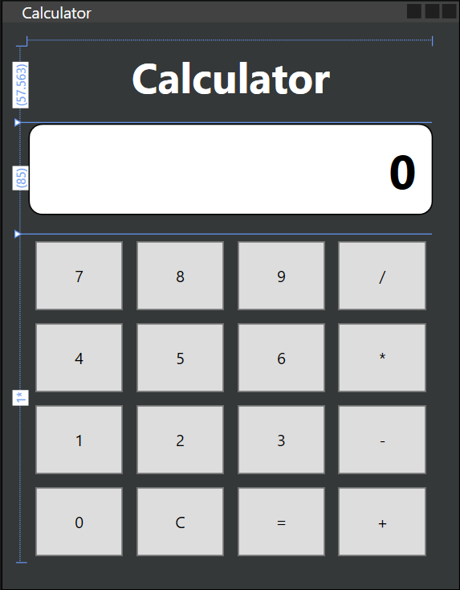

# WPF Calculator

A simple calculator built using WPF (.NET) and C#.

## Features

- Basic arithmetic operations (+, -, *, /)
- Clear button (C)
- Simple and responsive UI
- Built using WPF Grid layout

## Screenshots

## Technologies Used

- C#
- WPF (.NET)
- XAML

## How It Works

- Number buttons update the display
- Operator buttons store the first number and operation
- Equals button performs the calculation
- Clear resets everything

## How to Run

1. Clone the repository:
git clone https://github.com/muzammil-2003/WpfCalculator.git

2. Open the solution in Visual Studio

3. Run the project (F5)

## Future Improvements

- Decimal support
- Keyboard input
- Better UI design (modern styling)
- History of calculations

---

Made with learning and practice 🚀